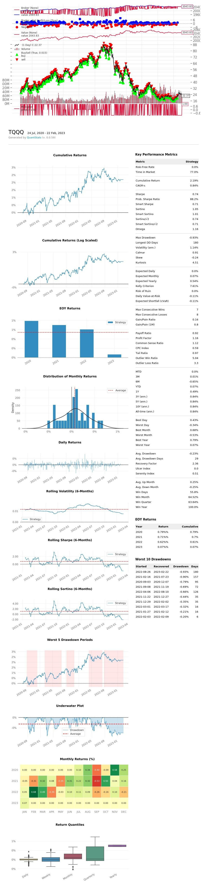

# Predict buy/sell/hold signal for stock & predict price range of stock
## What is the project?
The project is to predict signal of buy/sell/hold and price regression for a given stock symbol.
The stock price data is crawled from Yahoo Finance. The classification & regression model is based on xgb. The backtest of strategy is based on backtrader [https://github.com/mementum/backtrader] and zipline [https://github.com/quantopian/zipline]. In order to support Python>=3.10, source code of backtrader& zipline is modified and integrated.
## How to train classifier to predict buy/sell/hold signal?
### Model training

Example to train model for stock stick, TQQQ. --price_margin = 0.01 means if difference of close price in adjacent 2-day is less than 1%, signal is Hold. If today's price is more than 1% of last day's price, buy. Otherwise, sell. --capital means the initial cash available in backtesting strategy.  

 python ml_e2e_eval.p --target TQQQ  --model xgb --func train --price_margin 0.01 --capital 1000 

### Predict signal
Example to predict signal 
python ml_e2e_eval.py --target TQQQ --func realtime
## How to preidct price?
### Regression model training
python ml_e2e_eval.py --target TQQQ  --model xgb --func regressor
### Regression predict
python ml_e2e_eval.py --target TQQQ  --model xgb --func regressor_predict

Welcome to contact me if you enjoy the project.